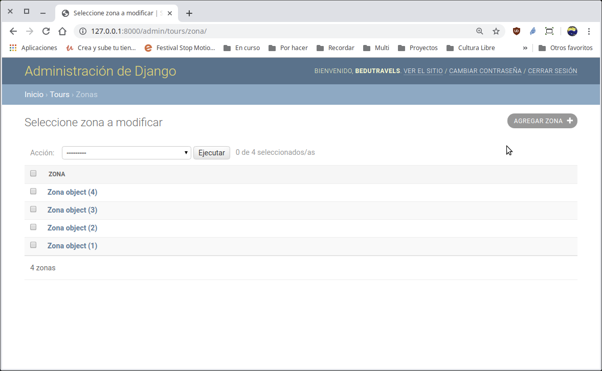
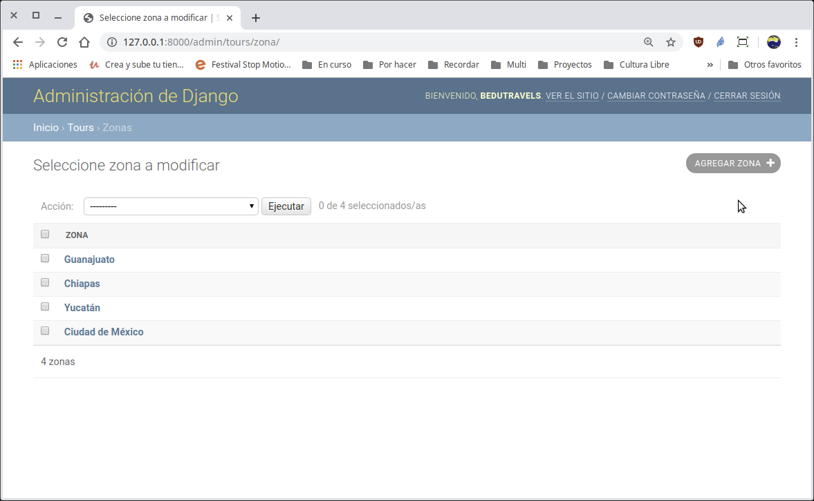
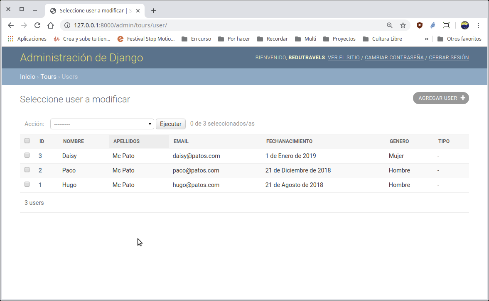

[`Backend con Python`](../../Readme.md) > [`Sesión 04`](../Readme.md) > Reto-01
## Creando una tabla con el modelo de datos de Django

### OBJETIVO
- Crear una tabla con el modelo de datos con Django.
- Agregando el modelo al administrador de Django

#### REQUISITOS
1. Actualizar repositorio
1. Usar la carpeta de trabajo `Sesion-04/Reto-01`
1. Diagrama del modelo entidad-relación para el proyect __Bedutravels__

   

1. Documentación de Django referente a modelos:
   - Descripción de modelos y ejemplos: https://docs.djangoproject.com/en/2.2/topics/db/models/
   - Referencia a la API de Modelos en Django https://docs.djangoproject.com/en/2.2/ref/models/
   - Referencia a los tipos de datos que maneja Django https://docs.djangoproject.com/en/2.2/ref/models/fields/#field-types

#### DESARROLLO
1. Usando el modelo entidad-relación, crear la tabla Zona agregando el siguiente código el archivo `Bedutravels/tours/models.py`:

   ```python
   class Zona(models.Model):
       """ Define la tabla Zona """
       nombre = models.CharField(max_length=45)
       descripcion = models.CharField(max_length=256, null=True, blank=True)
       latitud = models.DecimalField(max_digits=8, decimal_places=6, null=True, blank=True)
       longitud = models.DecimalField(max_digits=8, decimal_places=6, null=True, blank=True)
   ```
   Observar como el único atributo para crear una Zona es `nombre`

   __Avisando a Django que hemos modificado el archivo `models.py`:__

   ```console
   (Bedutravels) Reto-01/Bedutravels $ python manage.py makemigrations

   (Bedutravels) Reto-01/Bedutravels $ python manage.py migrate

   (Bedutravels) Reto-01/Bedutravels $
   ```

   __Agregando la tabla Zona al administrador de Django agregando las siguiente líneas al archivo `Bedutravels/tours/admin.py`:__

   ```python
   from django.contrib import admin
   from .models import User, Zona

   # Register your models here.
   admin.site.register(User)
   admin.site.register(Zona)
   ```
   Abrimos el navegador en la siguiente url ...

   Abrir la url http://localhost:8000/admin y usar los siguientes datos para entrar:
   - Usuario: bedutravels
   - Clave: bedutravels

   __Se deberá de ver algo similar a la siguiente imagen después de agregar 3 zonas:__

   

   ¿Podemos hacer algo para que el nombre del zona aparezca?
   ***

1. Modificando el modelo para User y Zona para que aparezca el nombre según corresponda:

   ```python
   class User(models.Model):
   [...]
     def __str__(self):
         """ Se define la representación en str para User """
         return "{} {}".format(self.nombre, self.apellidos)   
   ```
   De forma similar para el modelo de Zona, con lo que se obtiene el siguiente resultado:

   
   ***

1. También se puede hacer que aparezcan los campos que uno necesite, agregando el siguiente código al archivo `Bedutravels/tours/admin.py`:

   ```python
   class UserAdmin(admin.ModelAdmin):
       # Se sobre escribe lo que hace __str__
       list_display = ("id", "nombre", "apellidos", "email", "fechaNacimiento", "genero", "tipo")

   admin.site.register(User, UserAdmin)
   ```
   El resultado deberá ser similar al siguiente:

   
   ***
