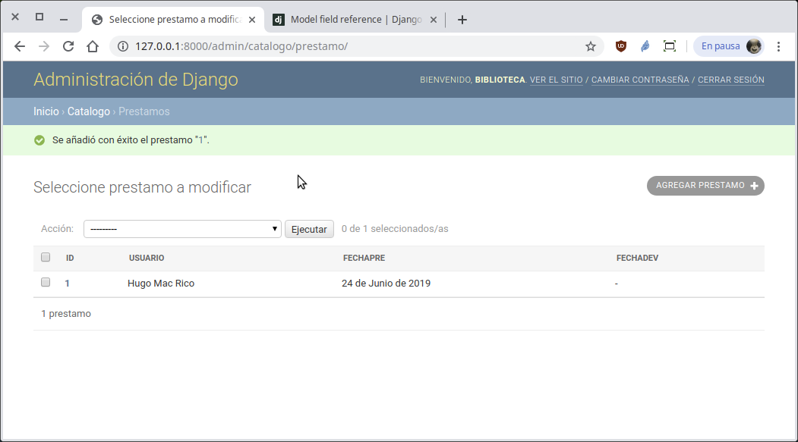

`Fullstack con Python` > [`Backend con Python`](../../Readme.md) > [`Sesión 09`](../Readme.md) > Ejemplo-02
## Creando relaciones uno a muchos con el modelo de datos de Django. Django.

### OBJETIVO
- Crear una relación uno a muchos entre dos tablas.

### REQUISITOS
1. Actualizar repositorio
1. Usar la carpeta de trabajo `Sesion-05/Ejemplo-02`
1. Diagrama del modelo entidad-relación para el proyect __Biblioteca__

   

1. Documentación de Django referente a modelos:
   - Descripción de modelos y ejemplos: https://docs.djangoproject.com/en/2.2/topics/db/models/
   - Referencia a la API de Modelos en Django https://docs.djangoproject.com/en/2.2/ref/models/
   - Referencia a los tipos de datos que maneja Django https://docs.djangoproject.com/en/2.2/ref/models/fields/#field-types

### DESARROLLO
1. Usando el modelo entidad-relación, crear la tabla Prestamo y su relación con la tabla Usuario.

   ```python
   class Prestamo(models.Model):
       """ Define la tabla Prestamo """
       usuario = models.ForeignKey(Usuario, on_delete=models.CASCADE)
       fechaPre = models.DateField(auto_now_add=True)
       fechaDev = models.DateField(null=True, blank=True)

       def __str__(self):
           """ Se define la representación en str para Prestamo """
           return str(self.id)
   ```

   __Avisando a Django que hemos modificado el archivo `models.py`:__

   ```console
   (Biblioteca) Ejemplo-02/Biblioteca $ python manage.py makemigrations
   (Biblioteca) Ejemplo-02/Biblioteca $ python manage.py migrate
   (Biblioteca) Ejemplo-02/Biblioteca $
   ```

   __Agregando la tabla Prestamo al administrador de Django y definiendo los campos a mostrar:__

   ```python
   from .models import Usuario, Libro, Prestamo

   class PrestamoAdmin(admin.ModelAdmin):
       # Se sobre escribe lo que hace __str__
       list_display = ("id", "usuario", "fechaPre", "fechaDev")
   admin.site.register(Prestamo, PrestamoAdmin)
   ```
   Abrimos el navegador en la siguiente url ...

   Abrir la url http://localhost:8000/admin y usar los siguientes datos para entrar:
   - Usuario: biblioteca
   - Clave: biblioteca

   __Se deberá de ver algo similar a la siguiente imagen después de agregar 1 prestamo:__

   
   ***
